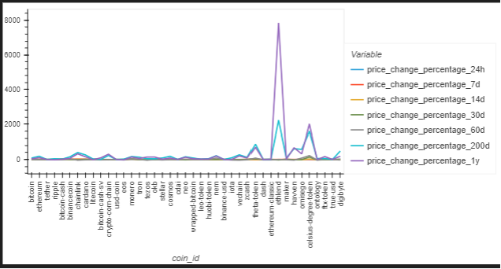

# CrytpoClustering
# Cryptocurrency-Challenge

Table of Contents
=================

  * [Objective](#objective)
  * [Method](#method)
  * [References](#references)
  
  
  
## Objective
  
  
Using knowledge of Python and unsupervised machine learning to predict if cryptocurrencies are affected by 24-hour or 7-day price changes.

## Method

### Prepare the Data

* Load the `crypto_market_data.csv` into a DataFrame.
* Obtain summary statistics and plot the data to assess the data.

!(Images/price_change_percentage_coin.png)  

* Use the StandardScaler() module from scikit-learn to normalize the data from the CSV file.
* Create a DataFrame with the scaled data and set the 'coin_id' index from the original DataFrame as the index for the new DataFrame.

 

### Find the Best Value for k Using the Original Scaled DataFrame

* Use the elbow method to find the best value for k completing the following steps:

        * Create a list with the number of k values from 1 to 11
        * Create an empty list to store the inertia values.
        * Create a for loop to compute the inertia with each possible value of k.
        * Create a dictionary with the data to plot the elbow curve.
        * Plot a line chart with all the inertia values to visually identify the optimal value for k.
  

**What is the best value for k?** The best value for k would be k=4.

### Cluster Cryptocurrencies with K-means Using the Original Scaled Data

* Use the following steps to cluster the cryptocurrencies for the best value for k on the original scaled data:

        * Initialize the K-means model with the best value for k.
        * Fit the K-means model using the original scaled DataFrame.
        * Predict the clusters to group the cryptocurrencies using the original scaled DataFrame.
        * Create a copy of the original data and add a new column with the predicted clusters.
        * Create a scatter plot using hvPlot
          
        
        

### Optimize Clusters with Principal Component Analysis

* Use the original scaled DataFrame, perform a PCA and reduce the features to three principal components.
* Retrieve the explained variance to determine how much information can be attributed to each principal component
* Create a new DataFrame with the PCA data and set the 'coin_id' index from the original DataFrame as the index for the new DataFrame.

  

**What is the total explained variance of the three principal components?** Total variance is the sum of variances of  all individual principal components.

### Find the Best Value for k Using the PCA Data

* Use the elbow method on the PCA data to find the best value for k completing the following steps:

        * Create a list with the number of k-values from 1 to 11
        * Create an empty list to store the inertia values.
        * Create a for loop to compute the inertia with each possible value of k.
        * Create a dictionary with the data to plot the Elbow curve.
        * Plot a line chart with all the inertia values to visually identify the optimal value for k.
  

**What is the best value for k when using the PCA data?** The best value for k when using the PCA data is k=4. 
**Does it differ from the best k value found using the original data?** No, it does not differ from the best k value using the original data.

### Cluster Cryptocurrencies with K-means Using the PCA Data

* Use the following steps to cluster the cryptocurrencies for the best value for k on the PCA data:

        * Initialize the K-means model with the best value for k.
        * Fit the K-means model using the PCA data.
        * Predict the clusters to group the cryptocurrencies using the PCA data.
        * Create a copy of the DataFrame with the PCA data and add a new column to store the predicted clusters.
        * Create a scatter plot using hvPlot
  
       

### Visualize and Compare the Results 

* Create composite plot to contrast the Elbow Curves 

  

* Create composite plot to contrast the Clusters 

  

**After visually analyzing the cluster analysis results, what is the impact of using fewer features to cluster the data using K-Means?** When analyzing the line plots for the elbow curves, the impact of using fewer features to cluster the data, is a steeper inertia drop. When analyzing the scatter plots for the cluster predictions, using fewer features results in tighter clusters and more entries within Cluster 0 and Cluster 1.

## References 

* Dataset provided by edX DU Data Analytics. This is intended for educational purposes only.

- - -
